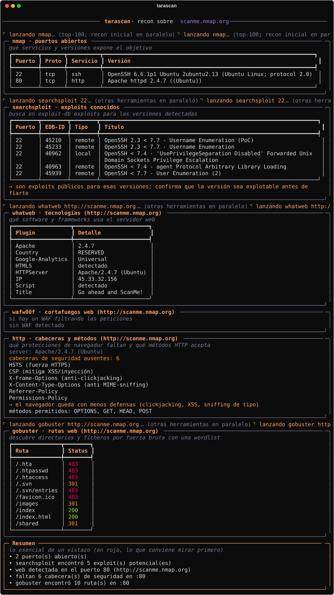

# TaraScan

Wrapper en Python que encadena herramientas de recon ya instaladas y unifica su salida en algo legible, en vez de ir lanzando cada herramienta suelta y leyendo formatos distintos.

> Úsalo solo contra objetivos propios o con autorización explícita.

## Estado

En desarrollo, pero ya cubre de sobra el recon de Fase 1 (red, web y SMB). La salida es por terminal y, con `-o`, se guarda también en Markdown.

Las herramientas se lanzan **en paralelo** y la salida va apareciendo por bloques según terminan, siempre en el mismo orden. Mientras una herramienta lenta (nmap NSE, nuclei) sigue trabajando, se muestra un spinner para que se vea que no está colgado.

## Requisitos

- Python 3.11+ (la dependencia `dnspython` se instala sola).
- **nmap** es el único imprescindible: es el punto de partida y decide qué más se lanza.
- El resto son opcionales; si una no está en el PATH, esa sección avisa y el escaneo sigue:
  - Web: `whatweb`, `gobuster`, `ffuf`, `nikto`, `nuclei`, `wafw00f`, `sslscan`, `wpscan`, `feroxbuster`.
  - Red/SMB: `smbclient`, `enum4linux`, `nbtscan`, `netexec` (binario `nxc`).
  - SNMP: `snmpwalk` (paquete `net-snmp`), `onesixtyone`.
  - Otros: `searchsploit` (exploit-db), `nc`, `subfinder`, `sqlmap`, `hydra`.

Notas:
- `nuclei` necesita descargar sus plantillas la primera vez: `nuclei -update-templates`.
- `gobuster`, `ffuf` y `onesixtyone` usan wordlists de `seclists` por defecto.
- `netexec` va mejor instalado con pipx (`pipx install git+https://github.com/Pennyw0rth/NetExec`) que desde bundles empaquetados.

## Instalación

```
pipx install .
```

Para desarrollo (modo editable):

```
pip install --user --break-system-packages -e .
```

## Uso

```
tarascan <dominio-o-ip>
```

Analiza **todos** los puertos web detectados (no solo el primero) y prueba cabeceras Host para descubrir sitios servidos por nombre (vhosts) detrás de un mismo puerto o proxy.

Opciones:

- `--full` — nmap escanea los 65535 puertos en vez del top-100 (más lento, pero no se deja nada).
- `--only LISTA` — ejecuta solo esas herramientas, separadas por coma (p.ej. `--only nmap,nuclei,smbclient`).
- `--skip LISTA` — omite esas herramientas (p.ej. `--skip nuclei,nikto`).
- `-o`, `--output [RUTA]` — guarda el informe en Markdown. Sin valor, lo deja en el directorio actual con un nombre automático (`tarascan-<objetivo>-<fecha>.md`). Con `RUTA`, si es una carpeta guarda dentro con nombre automático, y si es un fichero usa ese nombre.
- `--deep` — descubrimiento de contenido web recursivo con feroxbuster (más lento que gobuster, va fuera de la cadena por defecto).
- `--sqli` — lanza sqlmap contra la web detectada. **Intrusivo.**
- `--brute SERVICIO` — fuerza bruta de credenciales con hydra para ese servicio (`ssh`, `ftp`, `http-get`...). **Intrusivo, puede bloquear cuentas.**

La salida por terminal puede ser muy larga; para guardarla y leerla con calma, `tarascan objetivo -o` deja un `.md` con todo el informe (tablas incluidas).

## Laboratorio de pruebas

Escanea solo objetivos propios o con permiso. Para practicar sin meterte en un lío, el repo incluye en `test-lab/` un laboratorio en Docker con objetivos deliberadamente débiles y **locales**, pensado para que casi todas las herramientas tengan algo que encontrar:

- **WordPress** (puerto 80) → whatweb, wafw00f, http-headers, gobuster, ffuf, nikto, nuclei, wpscan, searchsploit.
- **HTTPS autofirmado** (443) → sslscan.
- **SMB** con share público sin autenticación (139/445) → smbclient, enum4linux, netexec.
- **SSH** con credencial débil `admin:password` (22) → searchsploit e `--brute ssh`.
- **SNMP** con comunidad `public` (161/udp) → onesixtyone, snmp.

Arrancarlo (la primera vez tarda un poco: descarga imágenes e instala WordPress):

```
cd test-lab
docker compose up -d      # o: docker-compose up -d
```

Escanearlo (literalmente la IP del Docker; en local es 127.0.0.1):

```
tarascan 127.0.0.1
```

Pararlo y borrar sus datos cuando termines:

```
docker compose down -v
```

> No expongas estos contenedores a Internet: están hechos para ser inseguros.

## Qué hace

A partir de un escaneo de nmap (con detección de versión), encadena el resto según lo que encuentre:

- **DNS** (solo si el objetivo es un dominio): registros A/MX/NS/TXT..., intento de transferencia de zona (AXFR), fuerza bruta de subdominios habituales (con detección de wildcard) y subdominios pasivos por OSINT (`subfinder`).
- **Siempre**: `searchsploit` busca exploits conocidos para cada servicio+versión detectado; los scripts NSE de nmap (`default` + `vuln` seguros) sobre los puertos abiertos; y una comprobación de SNMP (`onesixtyone` + `snmpwalk`), ya que 161/udp no aparece en el escaneo TCP.
- **Web** (si hay un puerto con servicio "http"): `whatweb`, `wafw00f` (detección de WAF), análisis de cabeceras de seguridad y métodos HTTP, `gobuster` (directorios), `ffuf` (archivos sensibles/backups), `nikto`, `nuclei` (vulnerabilidades por plantillas) y, si `whatweb` detecta WordPress, `wpscan`.
- **TLS** (en cada puerto HTTPS): `sslscan` — protocolos habilitados marcando los inseguros, cifrados débiles y datos del certificado.
- **SMB** (si hay 139/445): `smbclient`, `enum4linux`, `nbtscan` y `netexec` (sesión nula).

Al final siempre se imprime un **Resumen** en lenguaje llano: puertos abiertos, si hay web/SMB, hallazgos por herramienta y avisos marcados con `[!]` para lo más serio (TLS inseguro, métodos peligrosos, AXFR permitido, SNMP con comunidad válida...).

## Salida de ejemplo

Cada herramienta sale en su propia caja, con una explicación de qué mira y notas
que interpretan los hallazgos. Ejemplo real contra `scanme.nmap.org`:



Al final siempre hay un **Resumen** con lo esencial, marcando en rojo lo que conviene mirar primero.

## Herramientas encadenadas

| Fase | Herramientas |
|------|--------------|
| Red / puertos | nmap (con versión y scripts NSE), nc (banners), searchsploit |
| DNS (dominios) | dnspython (registros, AXFR, subdominios), subfinder |
| Web | whatweb, wafw00f, cabeceras HTTP, gobuster, ffuf, nikto, nuclei, wpscan, feroxbuster (`--deep`) |
| TLS | sslscan |
| SMB | smbclient, enum4linux, nbtscan, netexec |
| SNMP | onesixtyone, snmpwalk |
| Intrusivas (opt-in) | sqlmap (`--sqli`), hydra (`--brute`) |
