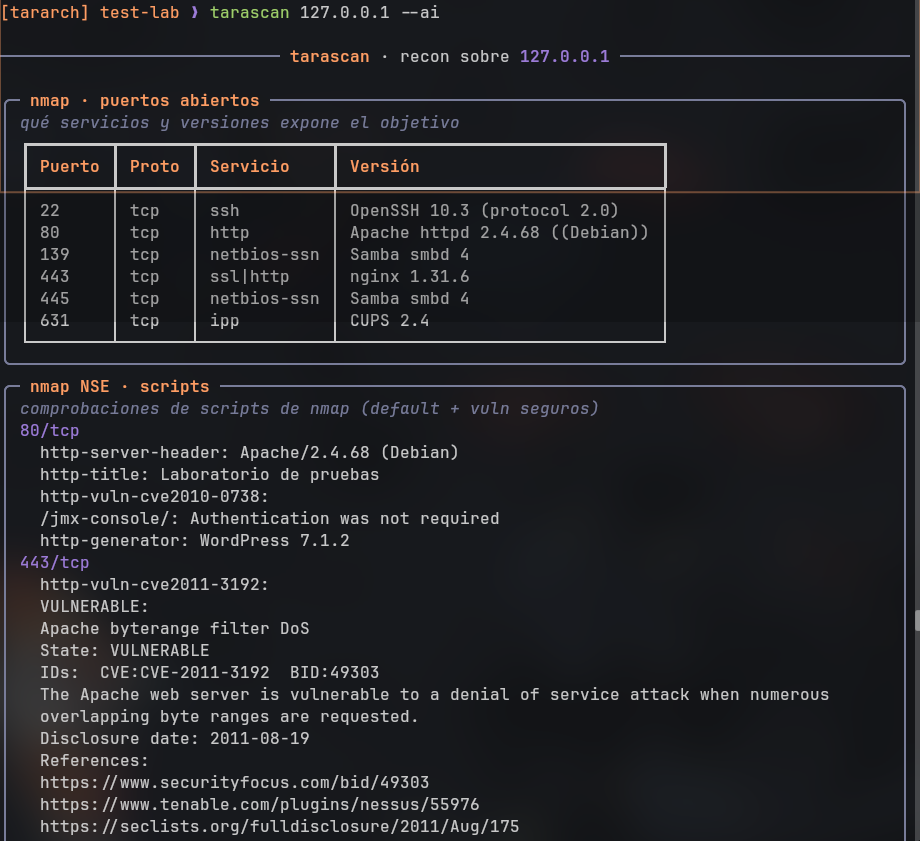
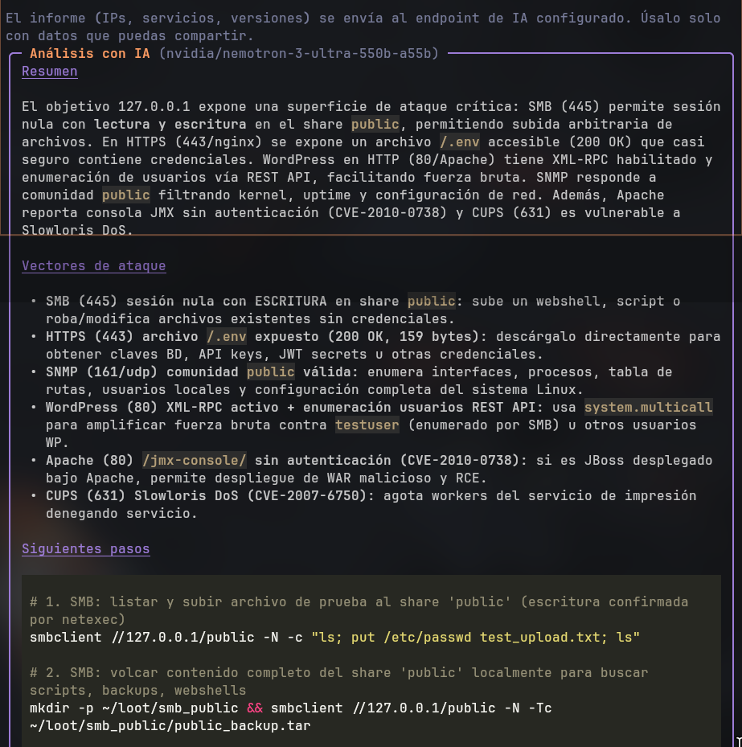
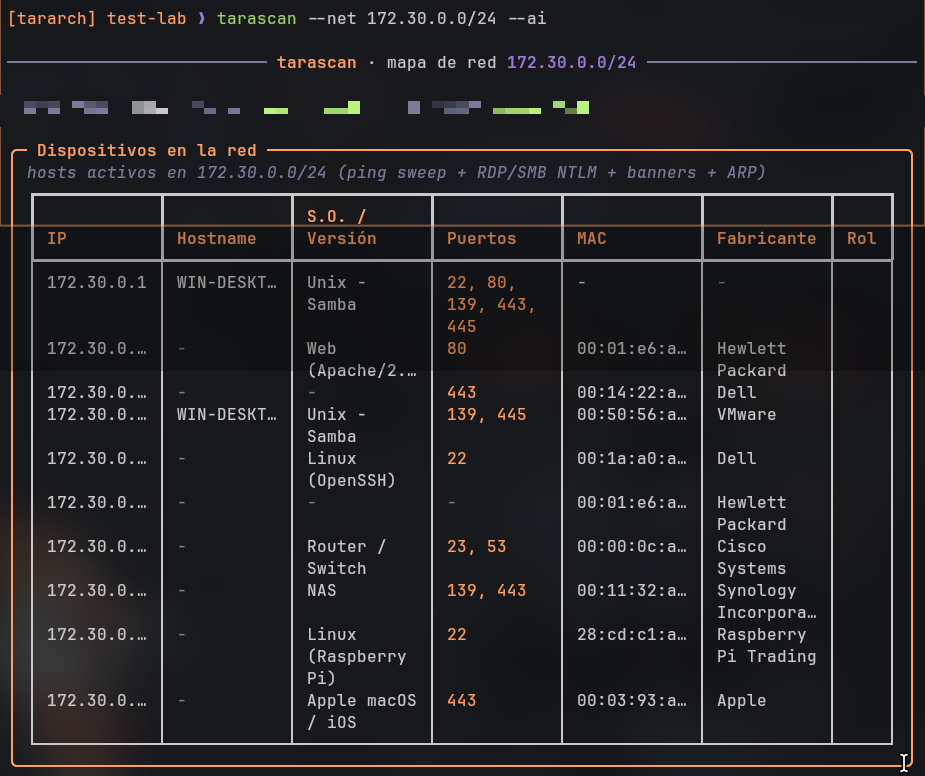
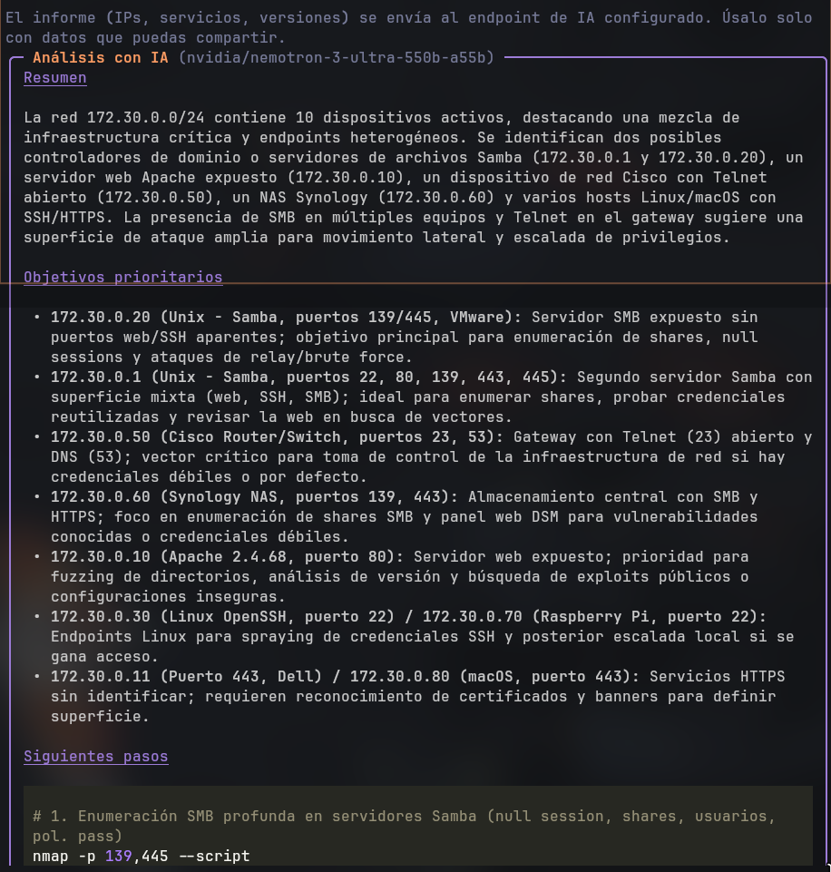

<p align="center"></p>

# TaraScan

Wrapper en Python que encadena herramientas de recon ya instaladas y unifica su salida en algo legible, en vez de ir lanzando cada herramienta suelta y leyendo formatos distintos.

> Úsalo solo contra objetivos propios o con autorización explícita.

## Estado

En desarrollo, pero ya cubre de sobra el recon de Fase 1 (red, web y SMB). Además del recon de un objetivo concreto, tiene un modo de **mapa de red local** (`--net`) que lista los dispositivos conectados con su SO, puertos, MAC y fabricante. La salida es por terminal y, con `-o`, se guarda también en Markdown.

Las herramientas se lanzan **en paralelo** y la salida va apareciendo por bloques según terminan, siempre en el mismo orden. Mientras una herramienta lenta (nmap NSE, nuclei) sigue trabajando, se muestra un spinner para que se vea que no está colgado.

## Capturas

Recon de un objetivo: puertos, versiones y scripts NSE.



Análisis con IA (`--ai`) de un objetivo: resumen, vectores de ataque y comandos listos para pegar.



Mapa de red local (`--net`): dispositivos activos con SO, puertos, MAC y fabricante.



Análisis con IA del mapa de red: objetivos prioritarios por dónde empezar.



## Requisitos

- Python 3.11+ (la dependencia `dnspython` se instala sola).
- **nmap** es el único imprescindible: es el punto de partida y decide qué más se lanza.
- El resto son opcionales; si una no está en el PATH, esa sección avisa y el escaneo sigue:
  - Web: `whatweb`, `gobuster`, `ffuf`, `nikto`, `nuclei`, `wafw00f`, `sslscan`, `wpscan`, `feroxbuster`.
  - Red/SMB: `smbclient`, `enum4linux`, `nbtscan`, `netexec` (binario `nxc`).
  - SNMP: `snmpwalk` (paquete `net-snmp`), `onesixtyone`.
  - Otros: `searchsploit` (exploit-db), `nc`, `subfinder`, `sqlmap`, `hydra`.

Notas:
- `nuclei` necesita descargar sus plantillas la primera vez: `nuclei -update-templates`.
- `gobuster`, `ffuf` y `onesixtyone` usan wordlists de `seclists` por defecto.
- `netexec` va mejor instalado con pipx (`pipx install git+https://github.com/Pennyw0rth/NetExec`) que desde bundles empaquetados.

## Instalación

```
pipx install .
```

Para desarrollo (modo editable):

```
pip install --user --break-system-packages -e .
```

## Uso

```
tarascan [dominio-o-ip]
```

Si no se especifica objetivo, usa automáticamente el fijado en `$T` o mediante `set-target`.

¿No tienes objetivo propio para practicar? El repo trae un laboratorio en Docker con objetivos débiles y locales: míralo en [Laboratorio de pruebas](#laboratorio-de-pruebas) y lanza las pruebas contra `127.0.0.1` o el mapa contra su subred, sin tocar nada de fuera.

### Mapa de red / descubrimiento local

Para rastrear la red local y ver todos los dispositivos conectados:

```
tarascan --net
# o con alias:
tarascan --map
```

Detecta automáticamente la interfaz activa, tu IP, gateway y subred. También puedes pasar una subred concreta (o pasar un CIDR como objetivo):

```
tarascan --net 192.168.1.0/24
tarascan 192.168.1.0/24
```

Muestra una tabla con IP, Hostname, Sistema Operativo y Versión (Windows 10/11 con número de build, Linux, Samba, etc.), Puertos abiertos, MAC, fabricante (base de prefijos OUI) y roles (gateway, este equipo).

Combina en paralelo:
- Ping sweep de nmap troceado por subredes.
- Extracción de nombres de equipo y versión de Windows vía RDP NTLM (`3389`).
- Extracción de dominio, nombre y SO vía SMB (`netexec`/`445`).
- Nombres NetBIOS con `nbtscan` (`137/udp`).
- Banners SSH (`22`) y HTTP (`80/8080`) para identificación de distribuciones Linux.
- Resolución DNS inversa rápida y caché ARP del kernel.

### Opciones de recon individual

Analiza **todos** los puertos web detectados (no solo el primero) y prueba cabeceras Host para descubrir sitios servidos por nombre (vhosts) detrás de un mismo puerto o proxy.

Opciones:

- `--net`, `--map [CIDR]` — modo mapa de red local en vez de recon de un objetivo (ver sección "Mapa de red / descubrimiento local" arriba). Sin CIDR usa tu subred actual.
- `--full` — nmap escanea los 65535 puertos en vez del top-100 (más lento, pero no se deja nada).
- `--only LISTA` — ejecuta solo esas herramientas, separadas por coma (p.ej. `--only nmap,nuclei,smbclient`).
- `--skip LISTA` — omite esas herramientas (p.ej. `--skip nuclei,nikto`).
- `-o`, `--output [RUTA]` — guarda el informe en Markdown. Sin valor, lo deja en el directorio actual con un nombre automático (`tarascan-<objetivo>-<fecha>.md`). Con `RUTA`, si es una carpeta guarda dentro con nombre automático, y si es un fichero usa ese nombre.
- `--deep` — descubrimiento de contenido web recursivo con feroxbuster (más lento que gobuster, va fuera de la cadena por defecto).
- `--sqli` — lanza sqlmap contra la web detectada. **Intrusivo.**
- `--brute SERVICIO` — fuerza bruta de credenciales con hydra para ese servicio (`ssh`, `ftp`, `http-get`...). **Intrusivo, puede bloquear cuentas.**
- `--ai` — al terminar, pasa el informe a un modelo de lenguaje y añade un resumen, lo crítico y comandos sugeridos. Opcional; necesita una clave de API propia (ver [Análisis con IA](#análisis-con-ia-opcional)).

La salida por terminal puede ser muy larga; para guardarla y leerla con calma, `tarascan objetivo -o` deja un `.md` con todo el informe (tablas incluidas).

## Análisis con IA (opcional)

Con `--ai`, al terminar el recon tarascan le pasa el informe a un modelo de lenguaje y añade una sección final con un resumen de verdad, los puntos críticos con su recomendación y comandos concretos para los siguientes pasos. Está apagado por defecto: sin el flag, tarascan no habla con ninguna IA.

### Necesitas tu propia clave de NVIDIA (gratis)

**La clave de API NO viene en el repo y nunca debe subirse a él.** Cada quien usa la suya: tarascan la lee de una variable de entorno, nunca de un fichero del proyecto. Funciona con el endpoint **gratuito de NVIDIA**, que es compatible con la API de OpenAI.

Para conseguir la tuya:

1. Entra en **[https://build.nvidia.com/](https://build.nvidia.com/)** y crea una cuenta (o inicia sesión).
2. Abre cualquier modelo de texto (por ejemplo [nemotron-3-ultra-550b](https://build.nvidia.com/nvidia/nemotron-3-ultra-550b-a55b)) y pulsa **"Get API Key"** (o "Build with this NIM"). Copia la clave: empieza por `nvapi-`.
3. Expórtala en tu shell (o, para que quede fija, añádela a tu `~/.zshrc` / `~/.bashrc`):

```
export TARASCAN_AI_KEY="nvapi-TU-CLAVE-AQUI"
```

4. Lanza un escaneo con `--ai`:

```
tarascan 127.0.0.1 --ai
```

> El free tier de NVIDIA es para prototipar: tiene límite de peticiones y puede cambiar. Para uso serio o con datos sensibles, usa tu propio modelo o un proveedor de pago (ver abajo cómo cambiar endpoint/modelo).

El análisis usa una **cadena de modelos con respaldo**: si el primero está saturado o no disponible (el free tier se llena a ratos), prueba automáticamente el siguiente. De más potente a más seguro: `nemotron-3-ultra-550b` → `nemotron-3-super-120b` → `gpt-oss-20b` → `llama-3.2-11b-vision`. El panel indica qué modelo respondió.

El endpoint y el modelo preferido se pueden cambiar sin tocar el código, por si NVIDIA renombra un modelo o prefieres otro proveedor compatible con OpenAI (OpenRouter, un Ollama local, etc.). Si fijas `TARASCAN_AI_MODEL`, ese se prueba primero y el resto de la cadena queda como respaldo:

```
export TARASCAN_AI_BASE="https://integrate.api.nvidia.com/v1"   # por defecto
export TARASCAN_AI_MODEL="nvidia/nemotron-3-ultra-550b-a55b"    # preferido; elige otro en build.nvidia.com
```

> **Privacidad:** con `--ai`, el informe (IPs, nombres de equipo, servicios y versiones) se envía al endpoint que hayas configurado, que es un tercero. Úsalo solo con datos que puedas compartir; para redes o clientes reales, mejor no.

## Laboratorio de pruebas

Escanea solo objetivos propios o con permiso. Para practicar sin meterte en un lío, el repo incluye en `test-lab/` un laboratorio en Docker con objetivos deliberadamente débiles y **locales**, pensado para que casi todas las herramientas tengan algo que encontrar:

- **WordPress** (puerto 80) → whatweb, wafw00f, http-headers, gobuster, ffuf, nikto, nuclei, wpscan, searchsploit.
- **HTTPS autofirmado** (443) → sslscan.
- **SMB** con share público sin autenticación (139/445) → smbclient, enum4linux, netexec.
- **SSH** con credencial débil `admin:password` (22) → searchsploit e `--brute ssh`.
- **SNMP** con comunidad `public` (161/udp) → onesixtyone, snmp.

Arrancarlo (la primera vez tarda un poco: descarga imágenes e instala WordPress):

```
cd test-lab
docker compose up -d      # o: docker-compose up -d
```

Escanearlo como objetivo concreto (literalmente la IP del Docker; en local es 127.0.0.1):

```
tarascan 127.0.0.1
```

Además, los contenedores viven en una subred Docker propia (`172.30.0.0/24`) con IP y MAC fijas, imitando una red con equipos variados, para que también puedas probar el **mapa de red**:

```
tarascan --net 172.30.0.0/24
```

Cada host está pensado para ejercitar una pieza del mapa (descubrimiento, puertos, banner, SMB, fabricante por OUI y SO deducido):

- `.10` **web** (WordPress, 80) → SO por cabecera `Server`, fabricante HP.
- `.11` **https** (443) → host con HTTPS suelto.
- `.20` **smb** (139/445) → nombre y SO (tipo Windows) vía `netexec`.
- `.30` **ssh** (22) → SO Linux por banner SSH.
- `.40` **snmp** → host vivo con MAC de fabricante.
- `.50` **router** (23/53) → MAC Cisco → `Router / Switch`.
- `.60` **nas** (139/443) → MAC Synology → `NAS`.
- `.70` **pi** (22) → banner SSH Raspbian + MAC Raspberry → `Linux (Raspberry Pi)`.
- `.80` **mac** (443) → MAC Apple → `Apple macOS / iOS`.

Los tres últimos y el router son dispositivos de pega (`test-lab/simdevice`): solo abren un par de puertos y su MAC decide el fabricante. Sirven para ver cómo tarascan deduce el tipo de equipo a partir del OUI.

Pararlo y borrar sus datos cuando termines:

```
docker compose down -v
```

> No expongas estos contenedores a Internet: están hechos para ser inseguros.

## Qué hace

A partir de un escaneo de nmap (con detección de versión), encadena el resto según lo que encuentre:

- **DNS** (solo si el objetivo es un dominio): registros A/MX/NS/TXT..., intento de transferencia de zona (AXFR), fuerza bruta de subdominios habituales (con detección de wildcard) y subdominios pasivos por OSINT (`subfinder`).
- **Siempre**: `searchsploit` busca exploits conocidos para cada servicio+versión detectado; los scripts NSE de nmap (`default` + `vuln` seguros) sobre los puertos abiertos; y una comprobación de SNMP (`onesixtyone` + `snmpwalk`), ya que 161/udp no aparece en el escaneo TCP.
- **Web** (si hay un puerto con servicio "http"): `whatweb`, `wafw00f` (detección de WAF), análisis de cabeceras de seguridad y métodos HTTP, `gobuster` (directorios), `ffuf` (archivos sensibles/backups), `nikto`, `nuclei` (vulnerabilidades por plantillas) y, si `whatweb` detecta WordPress, `wpscan`.
- **TLS** (en cada puerto HTTPS): `sslscan` — protocolos habilitados marcando los inseguros, cifrados débiles y datos del certificado.
- **SMB** (si hay 139/445): `smbclient`, `enum4linux`, `nbtscan` y `netexec` (sesión nula).

Al final siempre se imprime un **Resumen** en lenguaje llano: puertos abiertos, si hay web/SMB, hallazgos por herramienta y avisos marcados con `[!]` para lo más serio (TLS inseguro, métodos peligrosos, AXFR permitido, SNMP con comunidad válida...).

## Herramientas encadenadas

| Fase | Herramientas |
|------|--------------|
| Mapa de red (`--net`) | nmap (ping sweep), RDP NTLM, netexec (SMB), nbtscan, banners SSH/HTTP, ARP, OUI |
| Red / puertos | nmap (con versión y scripts NSE), nc (banners), searchsploit |
| DNS (dominios) | dnspython (registros, AXFR, subdominios), subfinder |
| Web | whatweb, wafw00f, cabeceras HTTP, gobuster, ffuf, nikto, nuclei, wpscan, feroxbuster (`--deep`) |
| TLS | sslscan |
| SMB | smbclient, enum4linux, nbtscan, netexec |
| SNMP | onesixtyone, snmpwalk |
| Intrusivas (opt-in) | sqlmap (`--sqli`), hydra (`--brute`) |
